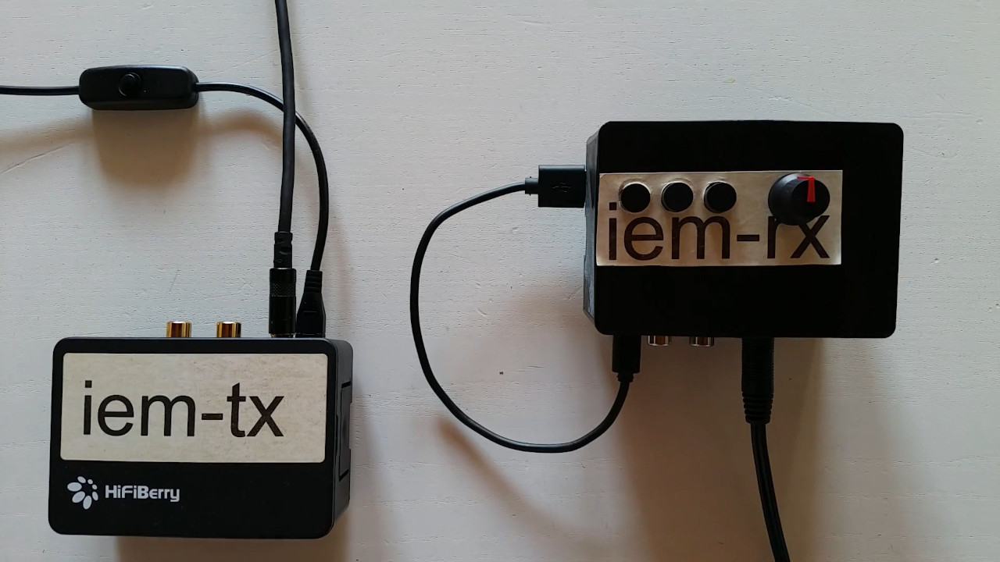

| :exclamation:  Project moved to [https://dri.ven.uber.space/this/Wi-Fi_IEM_Pi](https://dri.ven.uber.space/this/Wi-Fi_IEM_Pi) |
|-----------------------------------------|

# Wi-Fi IEM Pi
[In-Ear Monitor](https://en.wikipedia.org/wiki/In-ear_monitor)ing over wireless LAN using [Real-Time Linux](https://wiki.linuxfoundation.org/realtime/start) on [Raspberry Pi](http://www.raspberrypi.org/)

This project is for building another prototype based on [Wi-Fi IEM](https://github.com/thisven/Wi-Fi_IEM) powered by [RealtimePi](https://github.com/guysoft/RealtimePi) using [Zita-njbridge](https://kokkinizita.linuxaudio.org/linuxaudio/index.html) with [JACK Audio Connection Kit](https://github.com/jackaudio/) and [hostapd](https://w1.fi/hostapd/) for access point operation. In contrast to the Wi-Fi IEM project this fork implements further development to make the receiver ready for mobile usage, user control and automatic streaming startup by using [ecasound](https://nosignal.fi/ecasound/), TAP Dynamics (St) from [TAP plugins](https://github.com/tomszilagyi/tap-plugins) and [Cosmic Controller](https://github.com/bobrathbone/CosmicController).

Concerning to the new hardware and software used in this project I'd like to thank [Bob Rathbone](https://github.com/bobrathbone) for creating the Cosmic Controller and [Kai Vehmanen](https://github.com/kaivehmanen) for maintaining ecasound. But thanks to [Guy Sheffer](https://github.com/guysoft) (RealtimePi), Jouni Malinen (hostapd) and Fons Adriaensen (Zita-njbridge) as well.

## Requirements
Hardware components:
- 2x [Raspberry Pi 3 B+](https://www.raspberrypi.org/products/raspberry-pi-3-model-b-plus/) including SD card and power supply or a powerbank like the [Verico Power Guard 5000 mAh](https://www.vericoglobal.com/en/power-guard-5000mah/) for mobile receiver, respectively. Refer to [Raspberry Pi Documentation](https://www.raspberrypi.org/documentation/setup/) for details.
- [HifiBerry DAC+ ADC](https://www.hifiberry.com/shop/boards/hifiberry-dac-adc) HAT audio interface
- [Pi-DAC+](https://www.raspberrypi.org/products/iqaudio-dac-plus/) HAT audio interface
- [Cosmic Controller](https://github.com/bobrathbone/CosmicController) HAT controller interface
- [HifiBerry Case]() or likewise for transmitter
- Customized 3D printed enclosure: Use [IQAudio PI-DAC+ Enclosure](https://www.thingiverse.com/thing:2595204) by TechRoss to get started and build your own in [FreeCAD](https://www.freecadweb.org/) by importing STL files and extending the model.

You need terminal access on both Raspberry Pis to run scripts. Either physically or remotely using [SSH](https://www.raspberrypi.org/documentation/remote-access/ssh/README.md). Furthermore an internet connection is needed for installing packages.

## Hardware setup
Attach HifiBerry HAT and Pi-DAC+ to each Raspberry Pi respectively. You might need to solder components of the Cosmic Controller before attaching it onto the Pi-DAC+. Refer to [documentation](https://bobrathbone.com/raspberrypi/documents/IQaudIO%20Cosmic%20Controller.pdf) for this step. Lastly install transmitter parts into HifiBerry case and receiver parts into custom enclosure. Your setup should be similar to the picture.

## Installation
1. Flash a [nightly build of RealtimePi](http://unofficialpi.org/Distros/RealtimePi/nightly/) on both SD cards (refer to Raspberry Pi Documentation for how to flash SD cards with images) and power on Raspberry Pis afterwards.
2. Log in
3. Clone this git repository: `git clone https://github.com/thisven/Wi-Fi_IEM_Pi`
4. Change directory to Wi-Fi_IEM_Pi: `cd Wi-Fi_IEM_Pi`

### Setup the transmitter: iem-tx
5. Use Raspberry Pi with HifiBerry DAC+ on power supply as transmitter
6. Changing directory to iem-tx and run install-tx.sh script: `./install-tx.sh`
7. At the end the Raspberry Pi will reboot and the transmitter begins streaming

### Setup the receiver: iem-rx
8. Use Raspberry Pi with Pi-DAC+ and Cosmic Controller on powerbank as receiver
9. Changing directory to iem-rx and run install-rx.sh script: `./install-rx.sh`
10. After rebooting the receiver starts playing the stream

## Receiver controls
You can use Cosmic Controller rotary encoder to control receiver volume and its push button to mute the stream. To prevent a corrupt filesystem press the push button for at least 4 seconds to shutdon the receiver before disconnecting power. There are 3 mixing modes (mono, monomix, stereo) which can be selected by the buttons of the Cosmic Controller. At startup stereo mode is used. When pressing the button 1 (most distant from rotary encoder) for 4 seconds controls will be looked and can be unlocked by pressing it again for 4 seconds.

## Tipps and Tricks
If connection is dropping out, set a higher buffer for zita-n2j by changing _--buff 3_ to a higher value in /lib/systemd/system/zita-n2j.service unit in line 9 on receiver.

## Contribution and Donation
Feel free to spread the work, fork or contribute by other means to this project and its resources. Always remember to make a donation to developers and maintainers.

